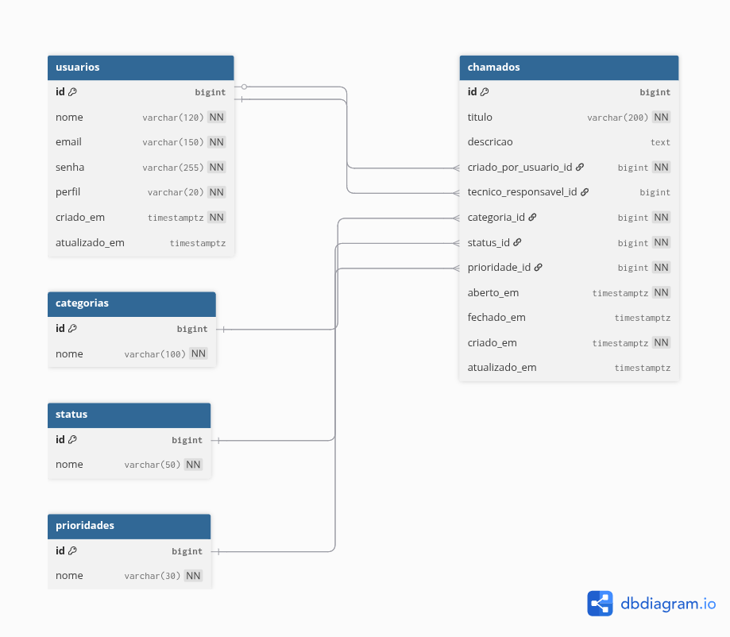

# Sistema de Gestão de Chamados Técnicos

## Desafio Backend

---

## 1. Introdução

Este documento descreve o desafio técnico para desenvolvimento da API do **Sistema de Gestão de Chamados Técnicos**.

O objetivo é avaliar a capacidade do candidato em:

* Modelagem de dados
* Arquitetura em camadas
* Desenvolvimento de API REST
* Aplicação de boas práticas com Spring Boot
* Organização e clareza de código

---

## 2. Contexto do Projeto

A empresa opera nacionalmente e possui múltiplos sistemas internos. Atualmente, o controle de chamados técnicos é realizado por meio de planilhas e comunicação informal, o que gera:

* Falta de rastreabilidade
* Baixa padronização
* Dificuldade de acompanhamento
* Retrabalho operacional

Este projeto tem como finalidade iniciar a construção de um sistema centralizado para gestão estruturada de chamados técnicos.

A primeira etapa consiste no desenvolvimento da API backend.

---

## 3. Escopo da Entrega

Deverá ser desenvolvida uma **API REST** responsável por:

* Cadastro e manutenção de usuários
* Cadastro e manutenção de categorias
* Cadastro e manutenção de prioridades
* Cadastro e manutenção de status
* Abertura e gestão de chamados
* Atribuição de técnicos
* Alteração de status
* Encerramento de chamados
* Listagem com filtros

Autenticação não faz parte do escopo deste desafio.

---

## 4. Stack Tecnológica Obrigatória

* Java 17 ou superior
* Spring Boot
* Spring Data JPA
* PostgreSQL
* Maven ou Gradle

---

## 5. Modelagem do Banco de Dados

A modelagem oficial do sistema deve seguir o diagrama abaixo.

## Diagrama

<p align="center">
  
</p>

A estrutura relacional deve respeitar os relacionamentos definidos no diagrama.

---

## 6. Entidades do Domínio

### 6.1 Usuário

Representa qualquer pessoa cadastrada no sistema.

Tipos permitidos:

* ADMIN
* USUARIO
* TECNICO

Responsabilidades:

* Pode abrir chamados
* Pode ser técnico responsável (somente se for do tipo TECNICO)

Restrição:

* O campo e-mail deve ser único no banco de dados

---

### 6.2 Chamado

Representa uma solicitação de suporte técnico.

Atributos obrigatórios:

* Título
* Criador
* Categoria
* Prioridade
* Status
* Data de abertura (gerada automaticamente)

Atributos opcionais:

* Técnico responsável
* Data de fechamento

---

### 6.3 Categoria

Classificação do tipo de problema.

Exemplos:

* Hardware
* Software
* Rede
* Acesso

---

### 6.4 Status

Define a situação atual do chamado.

Exemplos:

* Aberto
* Em andamento
* Finalizado

---

### 6.5 Prioridade

Define o nível de urgência do atendimento.

Exemplos:

* Baixa
* Média
* Alta
* Crítica

---

## 7. Regras de Negócio

As seguintes regras devem ser obrigatoriamente implementadas:

1. Apenas usuários com perfil `TECNICO` podem ser atribuídos como técnicos responsáveis.
2. A data de abertura do chamado deve ser gerada automaticamente.
3. Um chamado pode ser fechado apenas uma vez.
4. O e-mail do usuário deve ser único.
5. Um chamado não pode ser criado sem:

    * Título
    * Criador
    * Categoria
    * Prioridade
    * Status

Validações devem ser tratadas adequadamente com retorno correto de HTTP Status.

---

## 8. Arquitetura Esperada

O projeto deve seguir arquitetura em camadas:

* controller
* service
* repository
* entity (ou model)
* dto (recomendado)
* exception (tratamento global de erros)

Boas práticas esperadas:

* Uso adequado de ResponseEntity
* Tratamento global com @ControllerAdvice
* Separação clara de responsabilidades
* Código limpo e organizado
* Uso apropriado de validações (@Valid, Bean Validation)

---

## 9. Endpoints Obrigatórios

### 9.1 Usuários

| Método | Endpoint         | Descrição             |
| ------ | ---------------- | --------------------- |
| POST   | `/usuarios`      | Criar usuário         |
| GET    | `/usuarios`      | Listar usuários       |
| GET    | `/usuarios/{id}` | Buscar usuário por ID |
| PUT    | `/usuarios/{id}` | Atualizar usuário     |
| DELETE | `/usuarios/{id}` | Remover usuário       |

---

### 9.2 Categorias

| Método | Endpoint           | Descrição           |
| ------ | ------------------ | ------------------- |
| POST   | `/categorias`      | Criar categoria     |
| GET    | `/categorias`      | Listar categorias   |
| GET    | `/categorias/{id}` | Buscar categoria    |
| PUT    | `/categorias/{id}` | Atualizar categoria |
| DELETE | `/categorias/{id}` | Remover categoria   |

---

### 9.3 Status

| Método | Endpoint       | Descrição        |
| ------ | -------------- | ---------------- |
| POST   | `/status`      | Criar status     |
| GET    | `/status`      | Listar status    |
| GET    | `/status/{id}` | Buscar status    |
| PUT    | `/status/{id}` | Atualizar status |
| DELETE | `/status/{id}` | Remover status   |

---

### 9.4 Prioridades

| Método | Endpoint            | Descrição            |
| ------ | ------------------- | -------------------- |
| POST   | `/prioridades`      | Criar prioridade     |
| GET    | `/prioridades`      | Listar prioridades   |
| GET    | `/prioridades/{id}` | Buscar prioridade    |
| PUT    | `/prioridades/{id}` | Atualizar prioridade |
| DELETE | `/prioridades/{id}` | Remover prioridade   |

---

### 9.5 Chamados

#### Criar chamado

POST `/chamados`

---

#### Listar chamados

GET `/chamados`

Deve aceitar filtros opcionais:

```
/chamados?status=1
/chamados?prioridade=2
/chamados?categoria=3
/chamados?tecnico=5
```

---

#### Buscar chamado por ID

GET `/chamados/{id}`

---

#### Atualizar chamado

PUT `/chamados/{id}`

---

#### Atribuir técnico

PATCH `/chamados/{id}/atribuir-tecnico/{tecnicoId}`

---

#### Alterar status

PATCH `/chamados/{id}/status/{statusId}`

---

#### Fechar chamado

PATCH `/chamados/{id}/fechar`

Ao fechar o chamado, o sistema deve:

* Definir automaticamente o campo `fechado_em`
* Impedir que o chamado seja fechado novamente

---

#### Remover chamado

DELETE `/chamados/{id}`

---

## 10. Critérios de Avaliação

A avaliação considerará:

### Estrutura do Projeto

* Organização clara em camadas
* Separação adequada de responsabilidades

### Modelagem

* Relacionamentos corretos
* Integridade referencial
* Uso adequado do JPA

### Qualidade Técnica

* Boas práticas REST
* Uso correto de HTTP Status
* Tratamento de exceções
* Validações implementadas
* Clareza e legibilidade do código

---

## 11. Entrega

O repositório deve conter:

* Código fonte completo
* Instruções claras para execução
* Configuração do PostgreSQL
* Script SQL ou migrations
* README atualizado

---

## 12. Prazo Sugerido

3 a 5 dias.

---

## 13. Resultado Esperado

Ao executar a aplicação deve ser possível:

* Cadastrar usuários
* Cadastrar categorias
* Cadastrar prioridades
* Cadastrar status
* Abrir chamados
* Atribuir técnicos
* Alterar status
* Fechar chamados
* Listar chamados com filtros
